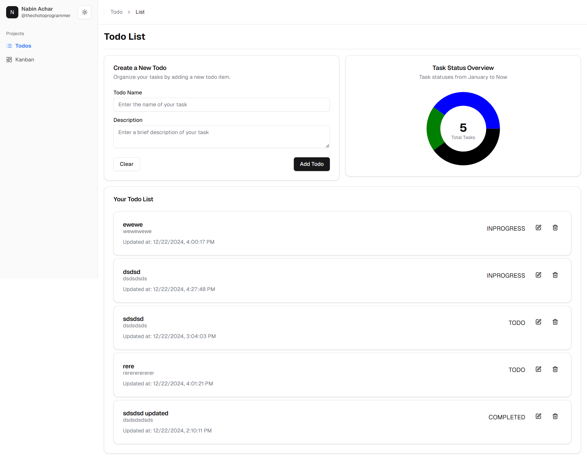
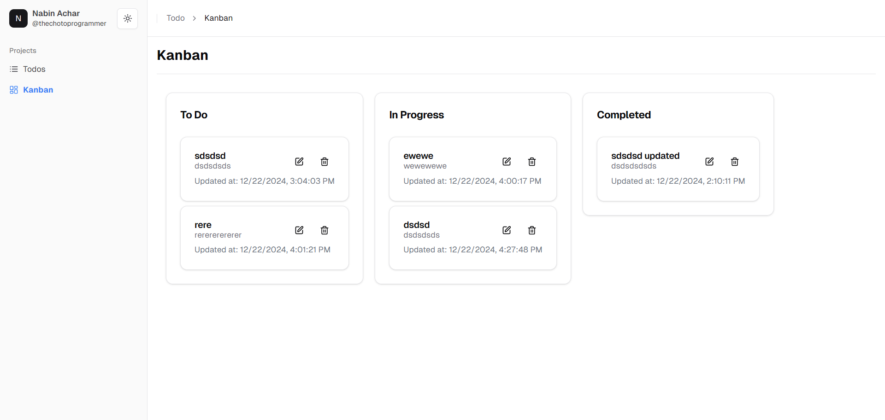
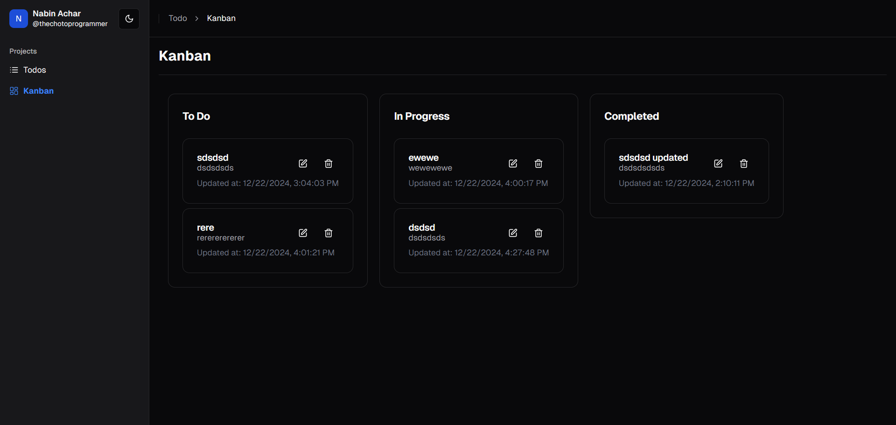

# Todo App with T3 Stack

A modern Todo application built using the powerful T3 stack to manage and organize your tasks efficiently. With advanced features like Todo charts, Kanban view, and a theme switcher, this app is perfect for task management.


## 📸 Preview





## 🚀 Technologies Used

- **[Prisma](https://www.prisma.io/)**: A modern ORM for interacting with the SQLite database.
- **[TypeScript (TS)](https://www.typescriptlang.org/)**: Type-safe JavaScript for improved development experience.
- **[Next.js (App Router)](https://nextjs.org/docs/app)**: The framework for building the app with server-side rendering and static site generation.
- **[SQLite](https://www.sqlite.org/)**: Lightweight, serverless database for data storage.
- **[Tailwind CSS](https://tailwindcss.com/)**: A utility-first CSS framework for fast styling.
- **[ShadCN UI](https://github.com/shadcn/ui)**: Elegant UI components for building modern web apps.
- **[React Query](https://tanstack.com/query)**: Data-fetching and caching solution for React.
- **[TRPC](https://trpc.io/)**: End-to-end typesafe API framework for full-stack development.

## 🛠️ Features

- **Add Todo**: Create new tasks effortlessly.
- **Edit Todo**: Update existing tasks with ease.
- **Delete Todo**: Remove tasks that are no longer needed.
- **Todo Chart**: Visualize your tasks in an insightful chart format.
- **Todo Kanban View**: Manage tasks in a dynamic Kanban board layout.
- **Theme Switch**: Toggle between light and dark themes for a customized experience.

## 🏃‍♂️ Getting Started

To get the project up and running on your local machine, follow these steps:

### 1. Install dependencies:
```bash
yarn install
```

### 2. Push the database schema:
```bash
yarn run db.push
```

### 3. Start the development server:
```bash
yarn run dev
```

The app will be live at [http://localhost:3000](http://localhost:3000).

## ✨ Author

[**Nabin Achar**](https://github.com/acharnabin)  
Feel free to check out more projects on my GitHub!

## 🔗 Connect with me

- [GitHub](https://github.com/acharnabin)
- [LinkedIn](https://www.linkedin.com/in/nabin-achar-57570b202)
- [Website](https://thechotoprogrammer.vercel.app/)

